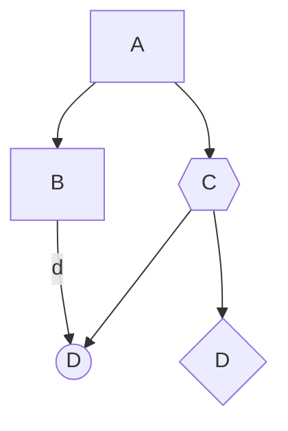

# Markdown

[문법](https://mermaid.js.org/syntax/flowchart.html)

## mermaid

예시 



[웹데이터 링크](https://mermaid.live/edit#pako:eNpVkEFvwjAMhf9K5NMmtYikpW1ymDTKxoVpk8ZpLYeoDSRiTaoQxFjb_75QxLT5ZPt978lyB5WpBTDYfppTJbl1aL0oNfL1WOTSqoNr-GGDwvChXwqHGqPFuUfzu6VBB2naVund_ZWfXyCUd6sLJpCTSu-Hq5SP_lcterQoVrx1pt38VdYn06OnQr1JH_9fkVZ413Ox5WzLw4pblHM7IhBAI2zDVe3P7y6bEpwUjSiB-bbmdl9CqQfP8aMz72ddAXP2KAI4tjV3YqH4zvLmthS1csa-XN8xfiWAlusPY34RPwLr4AtYiMmEUJpm8XQ2IxFOSRLAGVg0TSckSzCJSJzRWRINAXyPCdEEY0wTSuM0wzGNyfADQEBzdw)

[문법](https://mermaid.js.org/syntax/flowchart.html)


## Link

- Reference links

this is [a link][link-id]

[link-id]: https://github.com/nobodyoutside/python/issues/74
```
this is [a link][link-id]
[link-id]: https://github.com/nobodyoutside/python/issues/74
```
